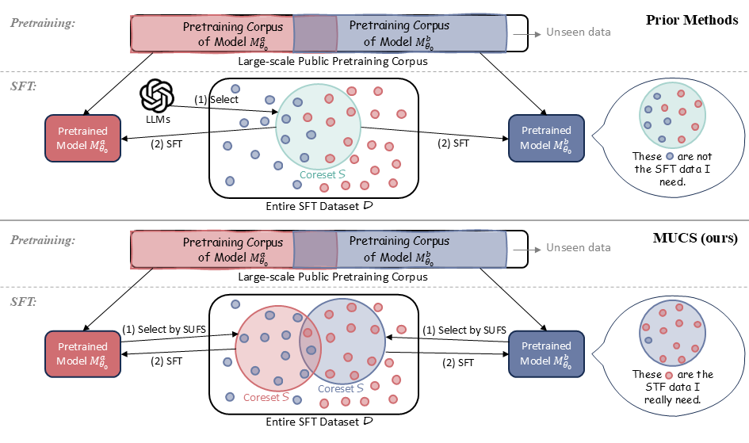

# MUCS: Constructing Compact SFT Data via Model-Unfamiliar-Guided Coreset Selection

Welcome to MUCS (**M**odel-**U**nfamiliar-Guided **C**oreset **S**election) Project!

## What is MUCS?



## How to start?

### Installation

```shell
conda create -n mucs python=3.12
conda activate mucs
cd mucs
pip install -r requirements.txt
```

### Sample-level Unfamiliarity Score Calculation

For details, please refer to the `mucs` directory.

### SFT Training

We use [LLaMA-Factory](https://github.com/hiyouga/LLaMA-Factory.) to fine-tune base models.

```json
  "tulu3_qwen_0_20k":{
    "file_name":"tulu3_qwen_0_20k.json",
    "formatting":"sharegpt",
    "columns":{
      "messages":"messages"
    },
    "tags":{
      "role_tag":"role",
      "content_tag":"content",
      "user_tag":"user",
      "assistant_tag":"assistant",
      "system_tag":"system"
    }
  }
```
```json
  "alpaca_qwen_0_percent5": {
    "file_name": "alpaca_qwen_0_percent5.json"
  }
```

For details, please refer to the `sft` directory.

### Evaluation

We use [OpenCompass](https://github.com/open-compass/opencompass) to evaluate fine-tuned models.


For details, please refer to the `opencompass` directory.
